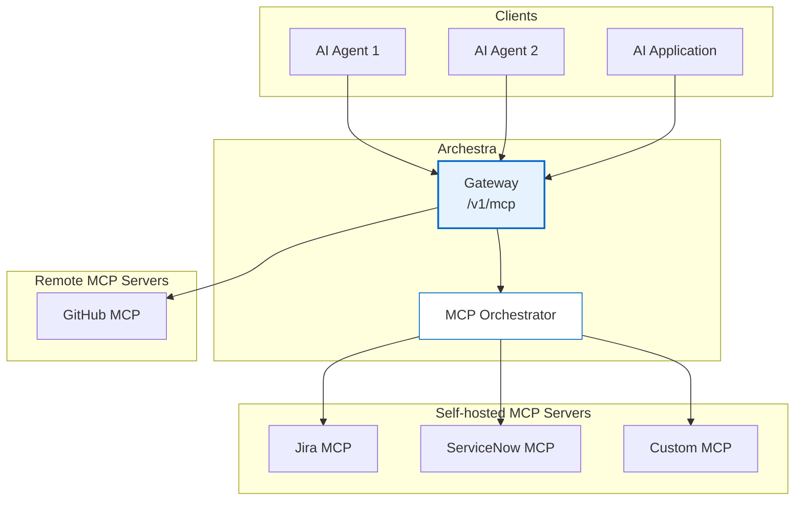

<!--
Check ../docs_writer_prompt.md before changing this file.

This document is human-built, shouldn't be updated with AI. Don't change anything here.

Exception:
- Screenshot
-->

MCP Gateway is the unified access point for all MCP servers in Archestra Platform. It provides a single endpoint through which AI agents and applications can discover and interact with multiple MCP servers, regardless of whether they are remote services or locally orchestrated containers.

## To use MCP Gateway:

1. Go to **MCP Registry** and make sure you have at least one MCP server installed.
2. Go to **MCP Gateways** and create a new gateway or use an existing one.
3. Click the pencil icon to open the **Edit MCP Gateway** form.
4. In the **Tools** section, assign MCP server tools to the MCP Gateway and save the changes by pressing **Update**.
5. Click the **Connect** icon to get connection instructions.



## Authentication

Archestra's MCP Gateways support three authentication methods:

- **OAuth 2.1** — MCP-native clients (Claude Desktop, Cursor, Open WebUI) authenticate automatically via the [MCP Authorization spec](https://modelcontextprotocol.io/specification/2025-11-25/basic/authorization). Supports both DCR and CIMD client registration.

- **Bearer Token** — For direct API integrations. Use `Authorization: Bearer archestra_<token>`. Tokens can be scoped to a user, team, or organization. Create tokens in **Settings → Tokens**.

- **External Identity Provider (JWKS)** — For MCP clients that authenticate with an external IdP (Keycloak, Okta, Entra ID, Auth0, etc.). The gateway validates JWT bearer tokens directly against the IdP's JWKS endpoint, allowing external users to access MCP tools without an Archestra account. Configure in **Settings → Identity Providers**, then select in the MCP Gateway's **Identity Provider (JWKS Auth)** dropdown.

See [MCP Authentication](/docs/mcp-authentication) for more details.

## MCP Rate Limits

MCP Gateway supports rate limiting per MCP server or per individual tool. Rate limits use a sliding window counter and can be scoped to an organization or team.

### Limit Types

- **Per-server** (`mcp_server_calls`) — limits total calls to any tool on a given MCP server within a time window
- **Per-tool** (`tool_calls`) — limits calls to a specific tool on a given MCP server within a time window

### Configuration

Go to **MCP & Tools > MCP Rate Limits** to create limits. Each limit requires:

- **Entity** — organization (applies to all agents) or a specific team
- **MCP Server** — which server the limit applies to
- **Window** — time window (1 minute, 1 hour, 1 day, 1 week, or 1 month)
- **Max calls** — maximum number of calls allowed within the window

### Enforcement

Limits are checked before each tool execution. When a limit is exceeded, the tool call returns an error result (not HTTP 429) with a message including the limit value, window, and approximate retry time:

```
Rate limit exceeded for MCP server 'github': 100 calls per 1 hour. Try again in approximately 1423 seconds.
```

Multiple limits can apply to the same call (e.g., both an organization-level and team-level limit). All applicable limits are checked — the first exceeded limit triggers the rejection.

### Monitoring

Rate limit rejections are tracked via the `mcp_rate_limit_rejections_total` Prometheus metric with labels `agent_id`, `agent_name`, `mcp_server_name`, `tool_name`, `limit_type`, and `entity_type`. A dedicated panel is available in the [MCP Monitoring](/docs/platform-observability#grafana-dashboards) Grafana dashboard.
