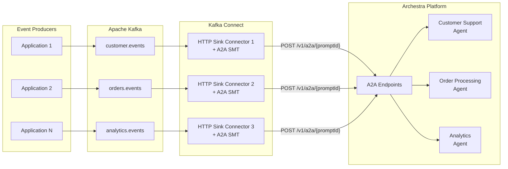
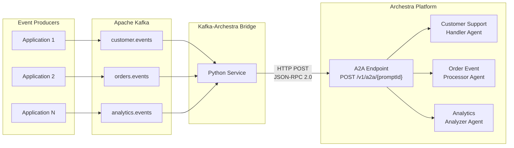
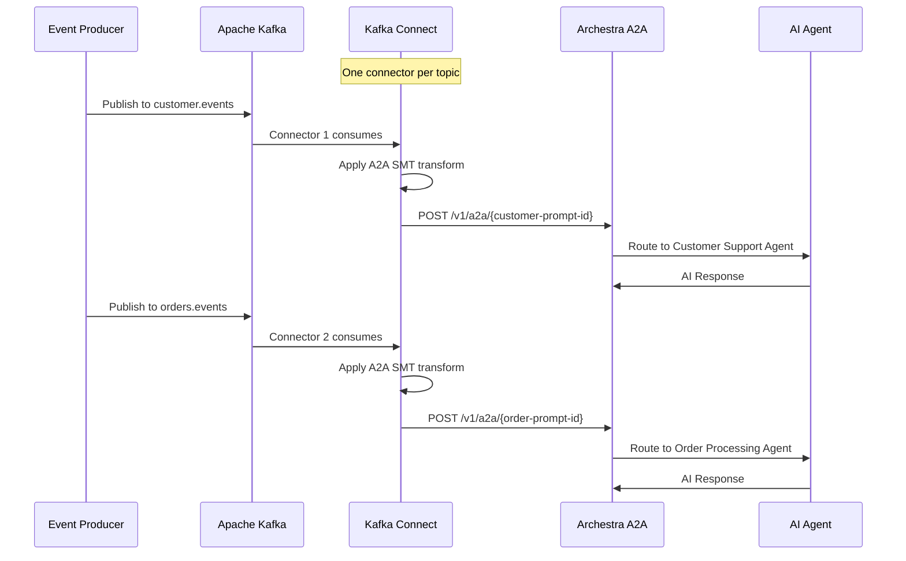

# Kafka to Archestra Integration Guide

This guide explains how to route Apache Kafka events to Archestra AI agents using the A2A (Agent-to-Agent) protocol. Two integration approaches are supported:

1. **Native Kafka Connect** (Recommended for production) - Uses Kafka Connect HTTP Sink with SMT
2. **Python Bridge Service** - Lightweight custom bridge for development/testing

## Quick Navigation

- [Architecture Overview](#architecture-overview)
- [Option 1: Native Kafka Connect](#option-1-native-kafka-connect-recommended)
- [Option 2: Python Bridge Service](#option-2-python-bridge-service)
- [Testing the Integration](#testing-the-integration)
- [Troubleshooting](#troubleshooting)

---

## Architecture Overview

### Option 1: Native Kafka Connect (Recommended)



### Option 2: Python Bridge Service



### How Multi-Topic Routing Works



---

## Prerequisites

- Docker and Docker Compose
- Archestra platform running locally (port 9000 for API, port 3000 for UI)
- LLM API keys configured in Archestra (Anthropic, OpenAI, or Google)

---

## Option 1: Native Kafka Connect (Recommended)

This approach uses Kafka Connect with HTTP Sink connectors to route messages directly to Archestra. Each Kafka topic gets its own connector that transforms messages to A2A JSON-RPC format using Single Message Transforms (SMT).

### Why Use Native Kafka Connect?

| Benefit | Description |
|---------|-------------|
| **Production-ready** | Built-in offset management, retries, and monitoring |
| **Scalable** | Add more connector tasks to scale horizontally |
| **No custom code** | Uses standard Kafka Connect infrastructure |
| **Fault-tolerant** | Automatic rebalancing and failover |
| **Open source** | Uses Aiven HTTP Connector (Apache 2.0 license) |

> **Important**: The Aiven HTTP Connector supports request body templating for A2A JSON-RPC format. The Confluent HTTP Sink Connector (commercial) does NOT support body templating and will send raw Kafka messages, causing 400 errors from the A2A endpoint. If using Confluent's connector, you'll need a custom SMT or consider using the Python bridge instead.

### Step 1: Create Archestra Agents

1. Navigate to http://localhost:3000/profiles and create profiles:
   - **Customer Support Agent** - for handling customer support requests
   - **Order Processing Agent** - for processing order events
   - **Analytics Insights Agent** - for analyzing metrics data

2. Navigate to http://localhost:3000/agents and create agents:
   - **Customer Support Handler** - using Customer Support Agent profile
   - **Order Event Processor** - using Order Processing Agent profile
   - **Analytics Analyzer** - using Analytics Insights Agent profile

3. For each agent, click the three-dot menu → **A2A Connect** to get:
   - The **Prompt ID** (UUID in the A2A endpoint URL)
   - The **A2A Token** (click "Expose token" to see the full token)

### Step 2: Start Kafka Connect Infrastructure

```bash
cd experiments/kafka-to-archestra

# Start Kafka + Kafka Connect
docker-compose -f docker-compose.native.yml up -d

# Wait for Kafka Connect to be healthy (may take 1-2 minutes)
docker-compose -f docker-compose.native.yml logs -f kafka-connect
# Wait for: "Kafka Connect started"
```

### Step 3: Deploy HTTP Sink Connectors

Set environment variables with your agent configuration:

```bash
# Get these from Archestra UI → Agents → A2A Connect
export ARCHESTRA_TOKEN=archestra_your_token_here
export CUSTOMER_SUPPORT_PROMPT_ID=your-customer-support-prompt-id
export ORDER_PROCESSING_PROMPT_ID=your-order-processing-prompt-id
export ANALYTICS_PROMPT_ID=your-analytics-prompt-id

# Deploy the connectors
./scripts/deploy-connector.sh
```

The script will:
1. Wait for Kafka Connect to be ready
2. Install the Aiven HTTP Sink connector (if needed)
3. Create one connector per topic/agent mapping
4. Display connector status

### How the A2A Transformation Works

Each HTTP Sink connector uses a request body template to transform Kafka messages into A2A JSON-RPC format:

```
Kafka Message:
  {"customer_id": "123", "message": "Help me with my order"}

A2A JSON-RPC Request:
  {
    "jsonrpc": "2.0",
    "id": "customer.events-0-42",
    "method": "message/send",
    "params": {
      "message": {
        "parts": [
          {"kind": "text", "text": "{\"customer_id\": \"123\", \"message\": \"Help me with my order\"}"}
        ]
      }
    }
  }
```

The template uses Mustache syntax:
- `{{topic}}` - Kafka topic name
- `{{partition}}` - Kafka partition number
- `{{offset}}` - Kafka offset (used as unique request ID)
- `{{value}}` - The original Kafka message content

### Step 4: Verify Connectors

```bash
# List all connectors
curl http://localhost:8083/connectors | jq

# Check connector status
curl http://localhost:8083/connectors/archestra-customer-support/status | jq

# Expected output:
# {
#   "name": "archestra-customer-support",
#   "connector": {"state": "RUNNING", ...},
#   "tasks": [{"state": "RUNNING", ...}]
# }
```

### Step 5: Optional - Start Kafka UI

```bash
docker-compose -f docker-compose.native.yml --profile debug up -d kafka-ui
```

Access at: http://localhost:8080

---

## Option 2: Python Bridge Service

A lightweight Python service that consumes Kafka messages and routes them to Archestra agents. Good for development, testing, or when you need custom transformation logic.

### Step 1: Create Archestra Agents

Same as Step 1 in Option 1 above.

### Step 2: Configure the Bridge

Update `.env` with your values:

```bash
# Archestra Configuration
ARCHESTRA_URL=http://host.docker.internal:9000
ARCHESTRA_TOKEN=archestra_your_token_here  # A2A token from step 1

# Agent Prompt IDs (from A2A Connect dialog)
CUSTOMER_SUPPORT_PROMPT_ID=your-customer-support-prompt-id
ORDER_PROCESSING_PROMPT_ID=your-order-processing-prompt-id
ANALYTICS_PROMPT_ID=your-analytics-prompt-id
```

Update `config/routes.json` with the same prompt IDs:

```json
[
  {
    "name": "customer-support",
    "topic_pattern": "customer.events",
    "prompt_id": "your-customer-support-prompt-id"
  },
  {
    "name": "order-processing",
    "topic_pattern": "orders.events",
    "prompt_id": "your-order-processing-prompt-id"
  },
  {
    "name": "analytics-insights",
    "topic_pattern": "analytics.events",
    "prompt_id": "your-analytics-prompt-id"
  }
]
```

### Step 3: Start the Infrastructure

```bash
cd experiments/kafka-to-archestra

# Start Kafka + Bridge
docker compose up -d

# Verify all services are running
docker compose ps
```

Expected output:
```
NAME                     STATUS
archestra-kafka          Up (healthy)
archestra-kafka-bridge   Up
archestra-zookeeper      Up (healthy)
```

---

## Testing the Integration

### Send Test Messages

#### Customer Support Events

```bash
echo '{"customer_id": "CUST-123", "issue_type": "billing", "priority": "high", "message": "I was charged twice."}' | \
docker exec -i archestra-kafka kafka-console-producer \
  --topic customer.events --bootstrap-server localhost:9092
```

#### Order Events

```bash
echo '{"order_id": "ORD-12345", "event_type": "shipped", "customer_email": "john@example.com", "details": "3 items shipped via UPS"}' | \
docker exec -i archestra-kafka kafka-console-producer \
  --topic orders.events --bootstrap-server localhost:9092
```

#### Analytics Events

```bash
echo '{"metric_name": "daily_active_users", "value": 15234, "timestamp": "2026-01-15T22:30:00Z", "dimensions": {"region": "us-west"}}' | \
docker exec -i archestra-kafka kafka-console-producer \
  --topic analytics.events --bootstrap-server localhost:9092
```

### Verify Processing

**For Native Kafka Connect:**
```bash
# Check connector task status
curl http://localhost:8083/connectors/archestra-customer-support/status | jq '.tasks[0]'

# View Kafka Connect logs
docker logs archestra-kafka-connect --tail 50
```

**For Python Bridge:**
```bash
# Check bridge logs
docker compose logs kafka-bridge --tail 50
```

**In Archestra:**
- Open http://localhost:3000/logs/llm-proxy
- Verify events are being processed by the correct agents

---

## Route Configuration

### Python Bridge Routes

Routes are configured in `config/routes.json`. Each route supports:

| Field | Description |
|-------|-------------|
| `name` | Unique identifier for the route |
| `topic_pattern` | Kafka topic name (supports `*` wildcard) |
| `prompt_id` | Archestra agent prompt ID |
| `header_match` | Optional: Match specific Kafka headers |
| `field_match` | Optional: Match specific JSON fields |
| `transform_template` | Optional: Transform message before sending |

### Transform Templates

Transform templates use `{field_name}` placeholders:

```json
{
  "transform_template": "New support request:\n\nCustomer: {customer_id}\nIssue: {issue_type}\n\nMessage:\n{message}"
}
```

### Kafka Connect Routing

With Kafka Connect, routing is configured via separate connector instances:
- One connector per topic → agent mapping
- Each connector has its own configuration
- Connectors can be added/removed without restarting

---

## Comparison: Native Kafka Connect vs Python Bridge

| Feature | Native Kafka Connect | Python Bridge |
|---------|---------------------|---------------|
| **Setup Complexity** | Medium | Low |
| **Scalability** | High (horizontal) | Medium (vertical) |
| **Customization** | Limited (SMT only) | Full (custom code) |
| **Monitoring** | Built-in (Connect REST API) | Custom |
| **Offset Management** | Automatic | Automatic |
| **Retries** | Built-in | Built-in |
| **License** | Open source (Aiven) | MIT |
| **Dependencies** | Kafka Connect cluster | Python runtime |
| **Best For** | Production | Development/Testing |

---

## Troubleshooting

### "Prompt not found" Error

- Ensure you're using the **prompt ID** from the Agent (not the profile ID)
- Get the correct ID from: Agent → Three-dot menu → A2A Connect

### "Invalid or unauthorized token" Error

- The A2A token is different from API keys
- Get the correct token from: Agent → Three-dot menu → A2A Connect → Expose token

### Kafka Connect: Connector in FAILED state

```bash
# Get detailed error
curl http://localhost:8083/connectors/<name>/status | jq '.tasks[0].trace'

# Restart connector
curl -X POST http://localhost:8083/connectors/<name>/restart

# Delete and recreate
curl -X DELETE http://localhost:8083/connectors/<name>
./scripts/deploy-connector.sh
```

### Messages Not Being Consumed

1. Check Kafka topics exist:
   ```bash
   docker exec archestra-kafka kafka-topics --list --bootstrap-server localhost:9092
   ```

2. Check consumer group status:
   ```bash
   docker exec archestra-kafka kafka-consumer-groups \
     --bootstrap-server localhost:9092 \
     --group archestra-connect-group --describe
   ```

### Container Not Reading Updated .env

Docker containers load `.env` at creation time. After updating `.env`:
```bash
# For Python Bridge
docker compose up -d kafka-bridge --force-recreate

# For Kafka Connect (redeploy connectors)
./scripts/deploy-connector.sh
```

---

## Cleanup

### Native Kafka Connect

```bash
# Stop and remove containers
docker-compose -f docker-compose.native.yml down

# Remove volumes (deletes Kafka data)
docker-compose -f docker-compose.native.yml down -v
```

### Python Bridge

```bash
docker compose down
docker compose down -v
```

---

## Next Steps

- Configure tool invocation policies in Archestra for agent security
- Set up monitoring and alerting
- Consider deploying to Kubernetes for production
- Explore using Archestra's built-in MCP tools with your agents
- See [ALTERNATIVES.md](docs/ALTERNATIVES.md) for other integration options
