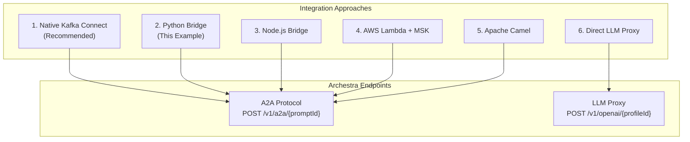
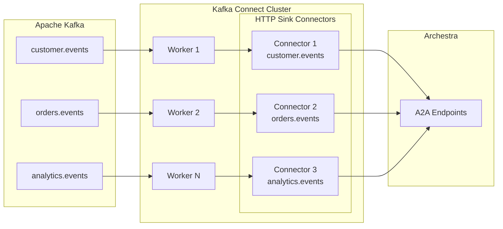
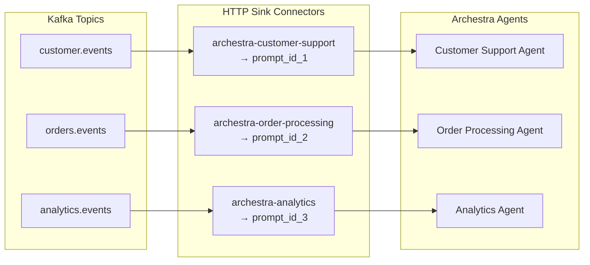
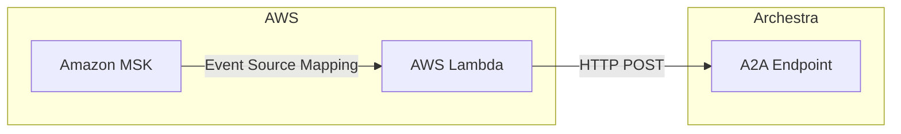
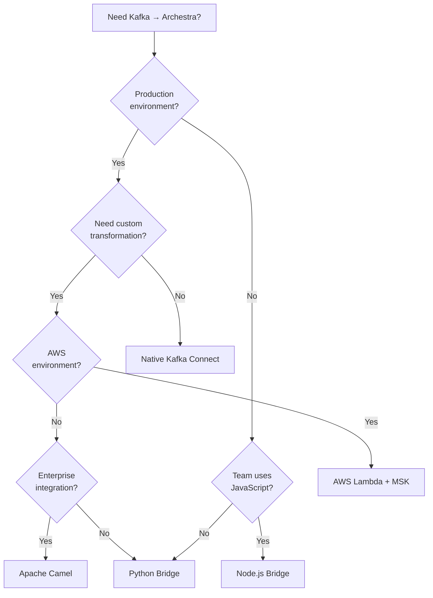

# Alternative Integration Approaches

This document describes various methods to integrate Kafka with Archestra beyond the Python bridge service and native Kafka Connect approach provided in this example.

## Integration Options Overview



---

## 1. Native Kafka Connect HTTP Sink (Recommended)

The production-ready approach using Kafka Connect with the Aiven HTTP Sink Connector (open source).

### Architecture



### Setup with Aiven HTTP Connector

The Aiven HTTP Connector is preferred over Confluent's connector because:
- **Open source** (Apache 2.0 license) - no commercial license required
- **Request body templating** - native Mustache support for A2A JSON-RPC format
- **Flexible authentication** - static headers, OAuth2, API keys

#### Connector Configuration

```json
{
  "name": "archestra-customer-support",
  "config": {
    "connector.class": "io.aiven.kafka.connect.http.HttpSinkConnector",
    "tasks.max": "3",
    "topics": "customer.events",

    "http.url": "http://archestra:9000/v1/a2a/${PROMPT_ID}",
    "http.authorization.type": "static",
    "http.headers.authorization": "Bearer ${ARCHESTRA_TOKEN}",
    "http.headers.content.type": "application/json",

    "batching.enabled": "false",
    "http.request.body.template": "{\"jsonrpc\":\"2.0\",\"id\":\"{{topic}}-{{partition}}-{{offset}}\",\"method\":\"message/send\",\"params\":{\"message\":{\"parts\":[{\"kind\":\"text\",\"text\":\"{{value}}\"}]}}}",

    "retry.backoff.ms": "1000",
    "max.retries": "3",

    "key.converter": "org.apache.kafka.connect.storage.StringConverter",
    "value.converter": "org.apache.kafka.connect.storage.StringConverter"
  }
}
```

#### A2A Request Body Template

The template transforms Kafka messages into A2A JSON-RPC format:

| Template Variable | Source | Example |
|-------------------|--------|---------|
| `{{topic}}` | Kafka topic name | `customer.events` |
| `{{partition}}` | Kafka partition | `0` |
| `{{offset}}` | Kafka offset | `42` |
| `{{value}}` | Message content | `{"customer_id": "123"}` |
| `{{key}}` | Message key | `cust-123` |
| `{{timestamp}}` | Message timestamp | `1705344000000` |

### Multi-Topic Routing Pattern

Each topic requires a separate connector with its own prompt ID:



### Alternative: Confluent HTTP Sink Connector

If using Confluent's commercial connector, you'll need SMTs for body transformation:

```json
{
  "name": "archestra-sink",
  "config": {
    "connector.class": "io.confluent.connect.http.HttpSinkConnector",
    "topics": "customer.events",
    "http.api.url": "http://archestra:9000/v1/a2a/${PROMPT_ID}",
    "headers": "Content-Type:application/json|Authorization:Bearer ${TOKEN}",
    "request.method": "POST",
    "batch.max.size": 1,

    "transforms": "wrapA2A",
    "transforms.wrapA2A.type": "org.apache.kafka.connect.transforms.HoistField$Value",
    "transforms.wrapA2A.field": "message",

    "reporter.result.topic.name": "archestra-responses",
    "reporter.error.topic.name": "archestra-errors"
  }
}
```

**Note**: Confluent's connector doesn't support full request body templating. For proper A2A JSON-RPC format, you'd need a custom SMT (Java code) or use the Aiven connector instead.

---

## 2. Python Bridge Service (This Example)

The Python bridge provided in this repository. Best for development, testing, or when you need custom transformation logic.

See [SETUP_GUIDE.md](../SETUP_GUIDE.md) for full documentation.

```python
# kafka-bridge.py - simplified example
from confluent_kafka import Consumer
import requests
import json

def send_to_archestra(prompt_id: str, message: str) -> dict:
    response = requests.post(
        f"{ARCHESTRA_URL}/v1/a2a/{prompt_id}",
        headers={
            "Content-Type": "application/json",
            "Authorization": f"Bearer {ARCHESTRA_TOKEN}",
        },
        json={
            "jsonrpc": "2.0",
            "id": str(uuid.uuid4()),
            "method": "message/send",
            "params": {
                "message": {
                    "parts": [{"kind": "text", "text": message}]
                }
            }
        }
    )
    return response.json()
```

---

## 3. Node.js/TypeScript Bridge

For teams preferring JavaScript/TypeScript:

```typescript
// kafka-bridge.ts
import { Kafka, Consumer, EachMessagePayload } from 'kafkajs';

interface Route {
  name: string;
  topicPattern: string | RegExp;
  promptId: string;
}

class KafkaArchestraBridge {
  private kafka: Kafka;
  private consumer: Consumer;
  private archestraUrl: string;
  private archestraToken: string;
  private routes: Route[];

  constructor(config: {
    kafkaBrokers: string[];
    groupId: string;
    archestraUrl: string;
    archestraToken: string;
    routes: Route[];
  }) {
    this.kafka = new Kafka({
      clientId: 'archestra-bridge',
      brokers: config.kafkaBrokers,
    });
    this.consumer = this.kafka.consumer({ groupId: config.groupId });
    this.archestraUrl = config.archestraUrl;
    this.archestraToken = config.archestraToken;
    this.routes = config.routes;
  }

  async start(topics: string[]): Promise<void> {
    await this.consumer.connect();
    await this.consumer.subscribe({ topics, fromBeginning: true });

    await this.consumer.run({
      eachMessage: async (payload: EachMessagePayload) => {
        await this.processMessage(payload);
      },
    });
  }

  private async processMessage({ topic, message }: EachMessagePayload): Promise<void> {
    const route = this.findRoute(topic);
    if (!route) {
      console.warn(`No route found for topic: ${topic}`);
      return;
    }

    const messageContent = message.value?.toString() || '';

    try {
      const response = await fetch(`${this.archestraUrl}/v1/a2a/${route.promptId}`, {
        method: 'POST',
        headers: {
          'Content-Type': 'application/json',
          'Authorization': `Bearer ${this.archestraToken}`,
        },
        body: JSON.stringify({
          jsonrpc: '2.0',
          id: crypto.randomUUID(),
          method: 'message/send',
          params: {
            message: {
              parts: [{ kind: 'text', text: messageContent }],
            },
          },
        }),
      });

      const result = await response.json();
      console.log(`Processed message from ${topic}:`, result);
    } catch (error) {
      console.error(`Failed to process message from ${topic}:`, error);
    }
  }

  private findRoute(topic: string): Route | undefined {
    return this.routes.find(route => {
      if (typeof route.topicPattern === 'string') {
        return topic === route.topicPattern ||
               (route.topicPattern.includes('*') &&
                topic.startsWith(route.topicPattern.replace('*', '')));
      }
      return route.topicPattern.test(topic);
    });
  }
}

// Usage
const bridge = new KafkaArchestraBridge({
  kafkaBrokers: ['localhost:9092'],
  groupId: 'archestra-bridge',
  archestraUrl: 'http://localhost:9000',
  archestraToken: process.env.ARCHESTRA_TOKEN!,
  routes: [
    { name: 'customer-support', topicPattern: 'customer.events', promptId: 'xxx' },
    { name: 'orders', topicPattern: /^orders\./, promptId: 'yyy' },
  ],
});

bridge.start(['customer.events', 'orders.events', 'orders.notifications']);
```

---

## 4. AWS Lambda with MSK

For serverless deployments on AWS with Amazon MSK (Managed Streaming for Kafka):



```python
# lambda_function.py
import json
import os
import uuid
import base64
import urllib3

http = urllib3.PoolManager()

ARCHESTRA_URL = os.environ['ARCHESTRA_URL']
ARCHESTRA_TOKEN = os.environ['ARCHESTRA_TOKEN']

# Topic to prompt ID mapping
ROUTES = {
    'customer.events': os.environ.get('CUSTOMER_SUPPORT_PROMPT_ID'),
    'orders.events': os.environ.get('ORDER_PROCESSING_PROMPT_ID'),
    'analytics.events': os.environ.get('ANALYTICS_PROMPT_ID'),
}

def handler(event, context):
    """AWS Lambda handler for MSK trigger."""
    results = []

    for record in event['records'].values():
        for message in record:
            topic = message['topic']
            value = base64.b64decode(message['value']).decode('utf-8')

            prompt_id = ROUTES.get(topic)
            if not prompt_id:
                print(f"No route for topic: {topic}")
                continue

            response = send_to_archestra(prompt_id, value)
            results.append({
                'topic': topic,
                'success': response is not None,
            })

    return {
        'statusCode': 200,
        'body': json.dumps({'processed': len(results)}),
    }

def send_to_archestra(prompt_id: str, message: str) -> dict:
    """Send message to Archestra A2A endpoint."""
    payload = {
        'jsonrpc': '2.0',
        'id': str(uuid.uuid4()),
        'method': 'message/send',
        'params': {
            'message': {
                'parts': [{'kind': 'text', 'text': message}]
            }
        }
    }

    response = http.request(
        'POST',
        f"{ARCHESTRA_URL}/v1/a2a/{prompt_id}",
        body=json.dumps(payload).encode('utf-8'),
        headers={
            'Content-Type': 'application/json',
            'Authorization': f'Bearer {ARCHESTRA_TOKEN}',
        }
    )

    if response.status == 200:
        return json.loads(response.data.decode('utf-8'))
    else:
        print(f"Error: {response.status} - {response.data}")
        return None
```

### AWS SAM Template

```yaml
# template.yaml
AWSTemplateFormatVersion: '2010-09-09'
Transform: AWS::Serverless-2016-10-31

Resources:
  ArchestraBridgeFunction:
    Type: AWS::Serverless::Function
    Properties:
      Handler: lambda_function.handler
      Runtime: python3.11
      Timeout: 30
      MemorySize: 256
      Environment:
        Variables:
          ARCHESTRA_URL: !Ref ArchestraUrl
          ARCHESTRA_TOKEN: !Ref ArchestraToken
          CUSTOMER_SUPPORT_PROMPT_ID: !Ref CustomerSupportPromptId
      Events:
        MSKEvent:
          Type: MSK
          Properties:
            Stream: !Ref MSKClusterArn
            Topics:
              - customer.events
              - orders.events
            StartingPosition: LATEST
            BatchSize: 10
```

---

## 5. Apache Camel Integration

For enterprise integration scenarios with complex routing logic:

```xml
<!-- camel-context.xml -->
<camelContext xmlns="http://camel.apache.org/schema/spring">

    <!-- Route for customer support events -->
    <route id="customer-support-route">
        <from uri="kafka:customer.events?brokers=localhost:9092&amp;groupId=archestra-bridge"/>

        <setHeader name="CamelHttpMethod">
            <constant>POST</constant>
        </setHeader>
        <setHeader name="Content-Type">
            <constant>application/json</constant>
        </setHeader>
        <setHeader name="Authorization">
            <simple>Bearer {{archestra.token}}</simple>
        </setHeader>

        <!-- Transform to A2A JSON-RPC format -->
        <process ref="a2aMessageTransformer"/>

        <toD uri="http://archestra:9000/v1/a2a/{{customer.support.prompt.id}}"/>

        <log message="Archestra response: ${body}"/>
    </route>

    <!-- Route for order events -->
    <route id="order-events-route">
        <from uri="kafka:orders.events?brokers=localhost:9092&amp;groupId=archestra-bridge"/>

        <setHeader name="CamelHttpMethod">
            <constant>POST</constant>
        </setHeader>
        <setHeader name="Authorization">
            <simple>Bearer {{archestra.token}}</simple>
        </setHeader>

        <process ref="a2aMessageTransformer"/>

        <toD uri="http://archestra:9000/v1/a2a/{{order.processing.prompt.id}}"/>
    </route>

</camelContext>
```

```java
// A2AMessageTransformer.java
@Component("a2aMessageTransformer")
public class A2AMessageTransformer implements Processor {

    @Override
    public void process(Exchange exchange) throws Exception {
        String body = exchange.getIn().getBody(String.class);

        Map<String, Object> a2aMessage = new LinkedHashMap<>();
        a2aMessage.put("jsonrpc", "2.0");
        a2aMessage.put("id", UUID.randomUUID().toString());
        a2aMessage.put("method", "message/send");

        Map<String, Object> params = new LinkedHashMap<>();
        Map<String, Object> message = new LinkedHashMap<>();
        List<Map<String, String>> parts = new ArrayList<>();

        Map<String, String> textPart = new LinkedHashMap<>();
        textPart.put("kind", "text");
        textPart.put("text", body);
        parts.add(textPart);

        message.put("parts", parts);
        params.put("message", message);
        a2aMessage.put("params", params);

        ObjectMapper mapper = new ObjectMapper();
        exchange.getIn().setBody(mapper.writeValueAsString(a2aMessage));
    }
}
```

---

## 6. Direct LLM Proxy Integration

Instead of using the A2A protocol, you can use Archestra's LLM Proxy directly with OpenAI-compatible SDK:

```python
# Using Archestra as OpenAI-compatible endpoint
from openai import OpenAI

client = OpenAI(
    base_url="http://archestra:9000/v1/openai/{profile_id}",
    api_key=os.environ["ARCHESTRA_TOKEN"],
)

def process_kafka_message(message: str) -> str:
    response = client.chat.completions.create(
        model="gpt-4o",  # Model configured in profile
        messages=[
            {"role": "system", "content": "You are a helpful assistant."},
            {"role": "user", "content": message},
        ],
    )
    return response.choices[0].message.content
```

**Note**: This approach uses the LLM Proxy endpoint (`/v1/openai/{profileId}`) instead of A2A (`/v1/a2a/{promptId}`). The LLM Proxy provides OpenAI-compatible API but doesn't include A2A protocol features like structured message parts.

---

## Comparison Matrix

| Approach | Setup | Scalability | Customization | Monitoring | License | Best For |
|----------|-------|-------------|---------------|------------|---------|----------|
| **Native Kafka Connect** | Medium | High | Limited (SMT) | Built-in | Open source | Production |
| **Python Bridge** | Low | Medium | Full | Custom | MIT | Development |
| **Node.js Bridge** | Low | Medium | Full | Custom | MIT | JS/TS teams |
| **AWS Lambda + MSK** | Medium | Auto-scaling | Medium | CloudWatch | N/A | AWS environments |
| **Apache Camel** | High | High | Full | Built-in | Apache 2.0 | Enterprise |
| **Direct LLM Proxy** | Low | Medium | Limited | Via Archestra | N/A | Simple use cases |

### Decision Guide



Choose based on your:
- **Infrastructure**: Cloud provider, container orchestration, existing Kafka Connect cluster
- **Team expertise**: Python, JavaScript, Java, or Kafka Connect experience
- **Scalability requirements**: Event volume, latency requirements
- **Operational preferences**: Managed services vs. self-hosted
- **Customization needs**: Simple routing vs. complex transformations
